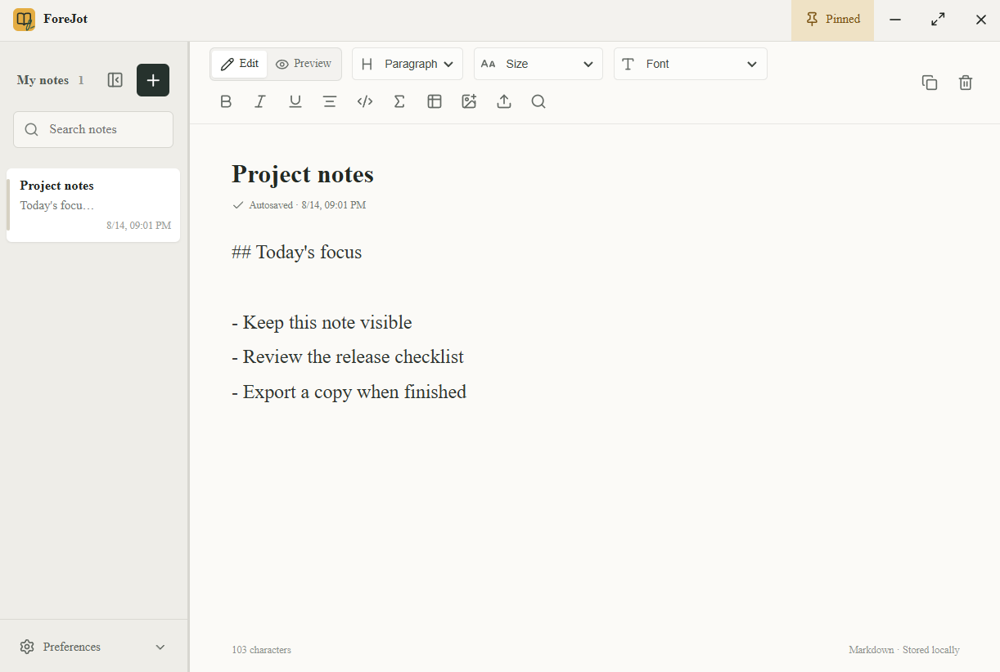

# ForeJot

> A local-first, always-on-top Markdown note app for Windows. Keep the note you are actively using visible, editable, and on your computer.

[中文说明](README.zh-CN.md) | [Release notes](docs/RELEASE_NOTES_1.0.1.md) | [中文发布说明](docs/RELEASE_NOTES_1.0.1.zh-CN.md)



ForeJot is maintained by an independent developer. "ForeJot" is the product name and does not represent a company or registered business entity.

## At a glance

ForeJot is for the note that belongs beside the work, not buried in a browser tab or a large workspace: a meeting action list, a calculation, a code snippet, a short research brief, or a daily checklist.

| Need | ForeJot approach |
| --- | --- |
| Keep a note in sight while working | The window is always on top by default, can be pinned or unpinned at any time, and has adjustable opacity. |
| Write quickly without changing tools | Markdown editing and live preview keep headings, lists, tables, task lists, code, links, and math in one compact note. |
| Keep technical material readable | KaTeX renders inline and display math; code blocks, tables, images, and syntax remain part of the same Markdown source. |
| Bring an existing draft with its images | Import Markdown, paste screenshots, insert local images, and repair missing absolute image paths by selecting their folder. |
| Share or archive the current note | Export the selected note to PDF, HTML, Word-compatible .doc, Markdown, or LaTeX. |
| Keep notes private | No account, cloud synchronization, advertising, telemetry, or note upload is required. Notes and settings stay in the current Windows user profile. |

## Why ForeJot

Many note products are designed around a knowledge base, a database, a browser workspace, or collaboration. ForeJot deliberately narrows the surface to the note currently helping you work.

| Difference | What it means in practice |
| --- | --- |
| Compact single-window layout | A resizable, collapsible note list and a focused editor or preview leave less interface to manage. It is practical at the edge of a screen instead of competing with the task at hand. |
| Local-first by design | There is no sign-in flow, sync engine, hosted workspace, plugin runtime, or background note upload. Fewer app-level services also mean fewer things to configure before taking a note. |
| One Markdown source | The text you edit is the text used for live preview and portable Markdown or LaTeX export. You can keep a durable plain-text representation instead of being locked into a proprietary document format. |
| Native Windows behavior | Always-on-top, system tray controls, launch at login, native save dialogs, and a global new-note shortcut are built into the desktop app rather than a browser tab. |
| Technical notes without a separate editor | KaTeX, fenced code blocks, Markdown tables, image attachments, and export are available in the same small working surface. |

ForeJot does not publish a cross-product memory benchmark. Electron memory use depends on Windows, note size, images, and the active preview. The design goal is lower operational overhead, not an unsupported numerical claim: it avoids cloud sync, background indexing services, and a multi-workspace application shell.

## Quick start

1. Download `ForeJot Setup 1.0.1.exe` from [GitHub Releases](../../releases/latest) and run it.
2. Choose English or Chinese in the installer. The selection sets the initial app language and default font.
3. Select **New note**, or press <kbd>Ctrl</kbd> + <kbd>Alt</kbd> + <kbd>N</kbd> from anywhere in Windows.
4. Write Markdown in **Edit** and switch to **Preview** when you want to review the rendered note.
5. Notes auto-save. Press <kbd>Ctrl</kbd> + <kbd>S</kbd> when you want an immediate save confirmation.
6. Use **Preferences** to choose export format, interface language, font, opacity, launch at login, and other desktop behavior.

## Keyboard reference

The formatting shortcuts below work while the note editor has focus. The global new-note shortcut works while ForeJot is running.

| Action | Windows shortcut | Result |
| --- | --- | --- |
| New note | <kbd>Ctrl</kbd> + <kbd>Alt</kbd> + <kbd>N</kbd> | Shows ForeJot and creates a note. |
| Save now | <kbd>Ctrl</kbd> + <kbd>S</kbd> | Persists the current state immediately; normal editing is also auto-saved. |
| Undo | <kbd>Ctrl</kbd> + <kbd>Z</kbd> | Reverses the latest supported edit or note deletion. |
| Find and replace | <kbd>Ctrl</kbd> + <kbd>H</kbd> | Opens the find-and-replace panel. Press <kbd>Esc</kbd> to close it. |
| Heading or paragraph | <kbd>Ctrl</kbd> + <kbd>0</kbd> to <kbd>5</kbd> | Applies paragraph or Heading 1 through Heading 5 to the current line or selection. |
| Bold | <kbd>Ctrl</kbd> + <kbd>B</kbd> | Toggles `**bold**` Markdown around the selection. |
| Italic | <kbd>Ctrl</kbd> + <kbd>I</kbd> | Toggles `*italic*` Markdown around the selection. |
| Underline | <kbd>Ctrl</kbd> + <kbd>U</kbd> | Toggles HTML underline markup around the selection. |
| Center text | <kbd>Ctrl</kbd> + <kbd>E</kbd> | Centers the selected paragraph or heading in the preview. |
| Insert code block | <kbd>Ctrl</kbd> + <kbd>Shift</kbd> + <kbd>K</kbd> | Inserts a fenced code block and places the cursor inside it. |
| Insert math block | <kbd>Ctrl</kbd> + <kbd>Shift</kbd> + <kbd>M</kbd> | Inserts a display-math block and places the cursor inside it. |

The toolbar provides the same formatting actions, plus text size, selected-text font, clipboard-table conversion, image insertion, Markdown import, and export. Use the pin button to toggle always-on-top.

## Write with Markdown

ForeJot uses Markdown source with live preview. You can type the syntax yourself or select text and use the toolbar or shortcuts.

### Common formatting

```markdown
# Project heading

**Bold** and *italic* and <u>underlined</u>

> A quotation

- A list item
- [ ] An unfinished task
- [x] A completed task

[ForeJot Releases](https://github.com/)
```

### Code and formulas

Press <kbd>Ctrl</kbd> + <kbd>Shift</kbd> + <kbd>K</kbd> to generate the code block below. You may add a language name after the opening fence for portability.

```javascript
const task = "Ship ForeJot";
console.log(task);
```

Use <kbd>Ctrl</kbd> + <kbd>Shift</kbd> + <kbd>M</kbd> for a display formula. Inline math uses one dollar sign on each side.

```markdown
The energy equation is $E = mc^2$.

$$
a^2 + b^2 = c^2
$$
```

KaTeX renders the result in Preview and in applicable exports. Standard LaTeX notation is supported by KaTeX; invalid expressions remain visible as source so they can be corrected.

### Tables and images

Paste tab-separated cells from a spreadsheet into the editor, then use the table button to convert the clipboard content to a Markdown table. You can also type a table directly:

```markdown
| Item | Owner | Done |
| --- | --- | --- |
| Release notes | Alex | Yes |
| Verify installer | Sam | No |
```

Paste an image from the clipboard or choose the image button. ForeJot stores it as a note attachment and keeps a short Markdown reference in the note. When importing Markdown, local and remote images are retained whenever they can be resolved; if an imported absolute path is missing, choose its containing image folder when prompted.

## Features

### Write and review

- Markdown editor and live preview with headings, lists, tables, task lists, quotations, code, links, underline, alignment, selected-text fonts, and text sizes.
- KaTeX inline and display math.
- Search titles and note content; duplicate, copy, delete, and reorder notes.
- Auto-save with an explicit save-now shortcut and undo for supported edits and deletions.
- English and Chinese interface language can be changed at any time.

### Images, import, and export

- Paste clipboard images or insert local image files.
- Import Markdown and retain local or remote image attachments when possible.
- Export the selected note to PDF, HTML, Word-compatible .doc, Markdown, or LaTeX; applicable exports include note images and math.

### Desktop controls

- Always-on-top, opacity, font, sidebar width, compact sidebar, and launch-at-login settings.
- System-tray controls and a global new-note shortcut.
- Includes Times New Roman, Segoe UI, Arial, Verdana, and Chinese Windows fonts.
- Native 64-bit Windows 10/11 desktop application.

## Language and installation

Download `ForeJot Setup 1.0.1.exe` from [GitHub Releases](../../releases/latest). Before installation begins, the installer asks whether to install the English or Chinese edition.

- On Chinese Windows, Chinese is selected by default and the app opens as **驻笺**.
- On other Windows languages, English is selected by default and the app opens as **ForeJot**.
- Chinese and English fonts are independent in both editions: Chinese text defaults to KaiTi and English text defaults to Times New Roman. Changing one does not change the other.
- In the app, **Preferences > Interface language** always lets the user switch between English and Chinese. Existing user choices are preserved on upgrades.

Requirements: 64-bit Windows 10 or Windows 11. The installer is not currently signed with a commercial code-signing certificate, so Windows SmartScreen may identify an unknown publisher. Download only from the project release page and compare the release checksum.

There is no automatic update service. Run a newer installer to update the app; existing notes are retained.

## Data, backup, and privacy

ForeJot has no accounts, cloud synchronization, advertising, telemetry, or note upload. Note content, embedded images, and settings are stored for the current Windows user at:

```text
%APPDATA%\floating-notes\notes.json
```

To back up, copy `notes.json`. Before restoring on another computer, fully quit ForeJot and back up any existing file there; replacing it replaces that computer's note state. Release assets and this source repository do not include user notes.

Remote images in imported Markdown and external links may contact the relevant websites when the user chooses to load or open them. See [Privacy](PRIVACY.md) for details.

## Development

Node.js 22 or later is required (Node.js 24 recommended).

```powershell
npm ci
npm run dev
```

Useful commands:

```powershell
npm test             # Run unit and UI tests
npm run build        # Type-check and build the renderer
npm run check:public # Check publishable files for local data and secrets
npm run qa:formula   # Run Electron formula rendering checks
npm run dist         # Build the Windows NSIS installer
```

The installer is written to `release/`, which is not committed to Git.

## Contributing

- Read [Contributing](CONTRIBUTING.md) before submitting a change or issue.
- Report vulnerabilities, private notes, or sensitive content through the private route in [Security](SECURITY.md), not a public issue.
- See [Changelog](CHANGELOG.md) for historical changes.

## License

Licensed under the [MIT License](LICENSE).
